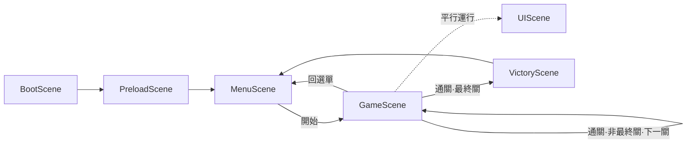

# 精準平台跳躍遊戲 — 製作規格書（定稿）

| 項目 | 內容 |
| --- | --- |
| 文件版本 | v0.1.0（定稿，可據以動工） |
| 文件狀態 | 9 段全數定稿；各段決策已拍板（見每段「本段決策」） |
| 技術棧 | Phaser 4.1 + Vite 8 + TypeScript 6.0（Arcade 物理） |
| 部署 | GitHub Actions → GitHub Pages |
| 基準解析度 | 1920 × 1080（FIT 等比縮放） |
| 拍板人 | Catz |

> **本文件為權威製作規格**，取代先前的 Phase 0–21 草案。
> `course/` 下的教學教材（講稿 + 網頁簡報）依本規格製作；若實作與教材有出入，**以本文件為準**。
> 第 4 段所有物理數值皆為「起始值」，手感須實際玩過用身體調（見 9.4）。

---

## 1. 專案概述與設計原則

### 1.1 遊戲定位

純粹的 **2D 精準平台跳躍遊戲**（precision platformer），參考座標是 Celeste、Super Meat Boy、N++ 這一類。

- **無敵人、無戰鬥、無血量。** 死亡是二元的：碰到陷阱即死，回到最近的紀錄點重生。
- 挑戰來自**地形本身**與**操作精度**，不是來自對手。
- 手感（game feel）是這個專案的命脈。物理參數調不好，這遊戲就是垃圾，沒有美術或關卡能救。

### 1.2 核心玩法迴圈

```
進入關卡 → 從紀錄點出生
  → 用 跳躍 / 二段跳 / 牆跳 / 衝刺 通過地形
  → 互動：踩開關、撿鑰匙、開門
  → 失誤碰陷阱 → 即死 → 回最近紀錄點（迴圈內重來，不中斷流程）
  → 抵達終點 → 通關
```

重點：**死亡重生必須快、無懲罰、零等待**。重生有任何卡頓或動畫拖延都是設計失敗。

### 1.3 玩家能力清單

| 能力 | 說明 | 備註 |
| --- | --- | --- |
| 水平移動 | 左右移動，有加速度與摩擦力，非瞬間滿速 | 手感關鍵 |
| 跳躍 | 可變高度（按住跳更高、放開即截斷上升） | 手感關鍵 |
| 二段跳 | 空中再跳一次，落地或牆跳後重置 | |
| 牆跳 | 貼牆時跳離牆面，給一個反向水平推力 | |
| 衝刺（dash） | 朝輸入方向快速位移，接觸地/牆重置（見第 4 段） | |

> 容錯機制（coyote time、jump buffer、牆跳寬限）屬「手感規格」，數值與判定窗口全部在第 4 段定義。

### 1.4 關卡互動元素清單

| 元素 | 行為 | 即死？ |
| --- | --- | --- |
| 地形（平台／牆） | 可站立、可貼牆，碰撞解析 | 否 |
| 陷阱 | 觸碰即死，回紀錄點 | **是** |
| 開關 | 啟動後觸發某狀態（開門等） | 否 |
| 鑰匙 | 撿取後可開對應的門 | 否 |
| 門 | 鎖定狀態擋路，條件滿足後開啟 | 否 |
| 紀錄點 | 通過後更新重生點 | 否 |
| 終點 | 抵達即通關 | 否 |

### 1.5 範圍界定（YAGNI — 這版「不做」什麼）

- ❌ 敵人、戰鬥、傷害數值、擊退、血量條
- ❌ 道具欄、裝備、技能樹、升級系統
- ❌ 程序生成關卡（關卡為手工設計、資料驅動）
- ❌ 多人連線
- ❌ 對話系統、劇情分支
- ❌ 存檔系統的複雜化（最多 localStorage 記通關進度）
- ❌ **移動平台**（列為進階選配，要加時當「開關的 target」接上，見 5.6）
- ❌ **能力拾取解鎖**（能力一開始就有，關卡靠地形＋鑰匙/門卡關，不靠鎖能力）

> 任何不在「能力清單／互動清單」裡的功能，預設**不做**，要做先回到規格書補一段、由拍板人定。

### 1.6 核心設計原則

1. **解析度無關設計**：所有設計數值用「單位」表達，**只在唯一一處**轉成 px。換解析度只動一個常數。
2. **容錯即正常情況，不是補丁**：coyote time、jump buffer 直接設計進輸入流程的正常路徑。
3. **死亡二元化，重生零成本**：碰陷阱＝死，無血量、無擊退；重生＝瞬間回紀錄點、狀態完全重置。
4. **資料驅動關卡**：地形、陷阱、開關、鑰匙、門、紀錄點、終點全部用資料定義，程式只讀資料生成。

### 1.7 本段決策（已定）

1. 專案代號 `precision-platformer`（正式名稱之後再定）。
2. 做關卡內計時顯示，不做排行榜。
3. 通關進度存 localStorage（只記最高通關關卡，不做雲端／多存檔）。
4. 開發期全用純色方塊佔位，手感與邏輯做穩再換素材。

---

## 2. 技術架構與專案結構

### 2.1 套件版本（2026/06 現況）

| 套件 | 鎖定版本 | 備註 |
| --- | --- | --- |
| Node.js | 22.x LTS | Vite 8 要求 20.19+ 或 22.12+ |
| Phaser | **4.1.x** | 重寫渲染器；破壞性變更集中在 FX/Mask/Shader，本純 Arcade 平台遊戲用不到 |
| Vite | **8.1.x** | 單一 Rolldown bundler |
| TypeScript | **6.0.x** | npm `latest` 穩定版 |
| ESLint + typescript-eslint / Prettier | 最新穩定 | 可選 |

> 鎖版策略：`package.json` 用 `^` 鎖在當前 minor，避免 `npm install` 拉上大版本打爛專案。

### 2.2 物理引擎：Arcade，不是 Matter.js

精準平台一律用 **Arcade**（AABB 軸對齊矩形）。理由：

- 精準平台要**可預測、可重現**的物理——同輸入永遠同結果。
- Matter.js 的剛體會旋轉、有摩擦擾動、會卡角，與「像素級精準」是天敵。
- 玩家的跳躍/牆跳/衝刺手感是**自己寫的速度控制**；Arcade 只負責「碰撞偵測與分離」，其餘我們接管。

### 2.3 專案資料夾結構

```text
precision-platformer/
├─ .github/
│  └─ workflows/
│     └─ deploy.yml          # GitHub Actions → Pages（第 8 段）
├─ public/                   # 不經打包的靜態檔
├─ src/
│  ├─ main.ts                # 進入點：建立 Phaser.Game
│  ├─ config/
│  │  ├─ GameConfig.ts       # Phaser GameConfig（解析度/Scale/物理）
│  │  └─ Units.ts            # 單位系統常數（唯一的 px 換算處）
│  ├─ scenes/
│  │  ├─ BootScene.ts        # 啟動、Scale Manager 設定
│  │  ├─ PreloadScene.ts     # 資源載入 + 進度條
│  │  ├─ MenuScene.ts        # 主選單
│  │  ├─ GameScene.ts        # 關卡主場景（地形/玩家/互動物）
│  │  ├─ UIScene.ts          # 疊加 UI（計時器/提示），與 GameScene 平行運行
│  │  └─ VictoryScene.ts     # 全破結算
│  ├─ entities/
│  │  └─ Player.ts           # 玩家狀態機：移動/跳躍/牆跳/衝刺（第 4 段）
│  ├─ systems/
│  │  ├─ InputManager.ts     # 輸入抽象層（鍵盤／手把）
│  │  ├─ CameraController.ts # 相機跟隨與邊界
│  │  ├─ CheckpointSystem.ts # 紀錄點與重生（第 5、6 段）
│  │  └─ SaveData.ts         # localStorage 薄封裝（unlockedLevel/bestTimes）
│  ├─ levels/
│  │  └─ level-01.json       # 資料驅動關卡（第 7 段）
│  ├─ types/
│  │  └─ level.ts            # 關卡資料的 TS 型別定義
│  └─ assets/                # 開發期佔位圖／音效（由 Vite import）
├─ index.html
├─ tsconfig.json
├─ vite.config.ts            # base path 設定（第 8 段）
└─ package.json
```

### 2.4 系統模組劃分（職責邊界，SRP / DIP）

| 層 | 職責 | 不該做的事 |
| --- | --- | --- |
| `config/` | 純常數與設定（單位、解析度、物理參數） | 不放邏輯 |
| `scenes/` | 編排：載入資料 → 生成物件 → 接線 → 驅動更新 | 不放玩家移動細節 |
| `entities/` | 物件自身行為（玩家狀態機、互動物狀態） | 不直接讀原始鍵盤、不管關卡載入 |
| `systems/` | 可重用服務（輸入、相機、紀錄點、存檔） | 不綁死特定關卡或 Scene |
| `levels/` + `types/` | 純資料 + 型別 | 不含執行邏輯 |

- **DIP**：`Player` 依賴 `InputManager` 的抽象（「有沒有按跳」「水平軸值」），不直接碰 `this.input.keyboard`。日後加手把、改鍵位只動 `InputManager`。
- **UIScene 平行運行**：HUD 獨立疊在 `GameScene` 上，死亡重建 `GameScene` 時不受影響。
- **資料驅動**：`GameScene` 讀 `level-XX.json` 生成地形與互動物，引擎本體不認識「第幾關」。

### 2.5 依賴清單（package.json 預期）

```jsonc
{
  "scripts": {
    "dev": "vite",
    "build": "tsc --noEmit && vite build",
    "preview": "vite preview"
  },
  "dependencies": {
    "phaser": "^4.1.0"
  },
  "devDependencies": {
    "typescript": "^6.0.0",
    "vite": "^8.1.0"
  }
}
```

> 套件管理器用 **npm**。

### 2.6 本段決策（已定）

- Phaser **4.1** + TypeScript **6.0**；第一版**鍵盤**（`InputManager` 預留手把）；物理引擎 **Arcade**。

---

## 3. 座標、單位與縮放系統

### 3.1 座標系統定義

採 **Phaser 原生座標**，不做任何翻轉或自訂變換：

- 原點 `(0, 0)` 在**左上角**；**X 向右為正**，**Y 向下為正**；重力方向 = Y 正向（向下）。
- **不做 Y 翻轉**：整個專案只用一套座標系，地面 Y 值就是大、天空 Y 值就是小。消除轉換層，bug 也跟著消失。

### 3.2 固定解析度與自動縮放

- **1920 × 1080 是「邏輯解析度」＝相機視野大小，不是關卡世界大小。** 世界可遠大於視野，相機跟玩家捲動。
- 所有遊戲邏輯永遠在固定的 1920×1080 邏輯空間運算，**程式碼永遠不碰實際裝置像素**。
- 縮放用 Phaser Scale Manager 的 **FIT**：等比縮放鋪滿、維持 16:9，多出處留黑邊（letterbox），`CENTER_BOTH` 置中。

#### `GameConfig.ts`（縮放與物理部分）

```ts
import Phaser from 'phaser';
import { BASE_WIDTH, BASE_HEIGHT } from './Units';

export const GameConfig: Phaser.Types.Core.GameConfig = {
  type: Phaser.AUTO,                 // 優先 WebGL，不支援才退回 Canvas
  parent: 'game',                    // index.html 內的 <div id="game">
  backgroundColor: '#1a1a1a',
  scale: {
    mode: Phaser.Scale.FIT,          // 等比縮放鋪滿、維持 16:9、留黑邊
    autoCenter: Phaser.Scale.CENTER_BOTH,
    width: BASE_WIDTH,               // 邏輯寬永遠 1920
    height: BASE_HEIGHT,             // 邏輯高永遠 1080
  },
  physics: {
    default: 'arcade',
    arcade: {
      // gravity 等物理數值於第 4 段定義
      debug: false,                  // 開發期可開 true 看碰撞框
    },
  },
  // scene 陣列於第 6 段定義
};
```

### 3.3 單位系統（唯一換算來源）

定義 **1 單位 (U) = 畫面高度的 10% = 1080 × 0.1 = 108 px**。全專案用「單位」表達設計數值，**只在 `Units.ts` 一處**轉成像素。

#### `Units.ts`

```ts
/**
 * 單位系統 — 全專案唯一的「單位 → 像素」換算來源。
 * 位置、速度、加速度等設計數值一律以「單位 (U)」表達，只在此檔轉成像素。
 */

/** 基準邏輯解析度（＝相機視野大小，非世界大小）。 */
export const BASE_WIDTH = 1920;
export const BASE_HEIGHT = 1080;

/** 1 單位 = 畫面高度的 10% = 108 px。 */
export const UNIT = BASE_HEIGHT * 0.1; // 108

/**
 * 單位 → 像素。長度、速度 (U/s)、加速度 (U/s²) 共用同一乘數，
 * 因為時間單位（秒）不變，換算只作用在「長度」維度。一個函式就夠。
 */
export const u = (units: number): number => units * UNIT;

/** 視野尺寸（以單位計）：高 = 10 U，寬 ≈ 17.78 U。 */
export const VIEW_W_UNITS = BASE_WIDTH / UNIT;  // ≈ 17.7778
export const VIEW_H_UNITS = BASE_HEIGHT / UNIT; // = 10
```

> `u(5)` = 540（px/s）、`u(30)` = 3240（px/s²）、`u(2)` = 216（px）。同一個 `u()` 通吃，因為秒不變、只換長度。

### 3.4 世界座標與單位網格

- 關卡世界座標一律以「單位」表達，存在關卡 JSON（第 7 段），載入時統一 `u()` 轉像素。
- 地形/陷阱/互動物的位置與尺寸都用單位。例：平台 `{ x: 3, y: 8, w: 2, h: 1 }`（單位）→ 載入各 ×108 變像素。
- **單位網格**作為設計對齊基準：建議地形對齊 `0.5 U`（54px）網格，但位置允許任意浮點（精準平台常需非整數落點）。

### 3.5 換算速查表

| 用途 | 設計值 | 乘數 | 像素值 |
| --- | --- | --- | --- |
| 位置／長度 | 1 U | ×108 | 108 px |
| 位置／長度 | 2 U | ×108 | 216 px |
| 速度 | 5 U/s | ×108 | 540 px/s |
| 加速度 | 30 U/s² | ×108 | 3240 px/s² |
| 視野高 | 10 U | ×108 | 1080 px |
| 視野寬 | ≈17.78 U | ×108 | 1920 px |

### 3.6 像素清晰度（待美術階段確認）

開發期用純色方塊佔位，先不糾結。等美術風格定了再確認 `roundPixels`、`antialias` / `pixelArt` 兩組旗標（會影響移動觀感）。

### 3.7 本段決策（已定）

- 座標採 Phaser 原生（**Y 向下、不翻轉**）；設計網格 **0.5 U**（引擎不強制吸附）。

---

## 4. 玩家物理與手感規格

> **本段所有數值皆為「起始值」，不是定論。** 手感必須實際玩過用身體調。這裡給一套**內部自洽、可直接開跑**的起點。

### 4.1 設計總則

1. **手感優先**：寧可花時間調這 30 個數字，不要急著加關卡。
2. **速度控制自己接管**：Arcade 只做碰撞偵測與分離，加速/煞車/跳躍/衝刺全是自寫的速度設定。
3. **單一接觸重置規則**：**接觸地面或牆面的瞬間，一律重置「二段跳次數、衝刺次數、coyote 計時」。** 不分地面/牆面寫兩套。
4. **時間用 delta 累加計數**，不用 `setTimeout`、不用 Promise。所有計時器都是每幀 `counter -= dt` 倒數。

### 4.2 玩家碰撞箱

| 參數 | 單位值 | px 值 |
| --- | --- | --- |
| 寬 | 0.6 U | ≈ 65 px |
| 高 | 0.9 U | ≈ 97 px |

> 碰撞箱用 AABB（不旋轉）。視覺精靈可大於碰撞箱，碰撞以箱為準。

### 4.3 水平移動

| 參數 | 單位值 | px 值 | 說明 |
| --- | --- | --- | --- |
| 最大跑速 | **8 U/s** | 864 px/s | 手感第一號變數 |
| 地面加速度 | 60 U/s² | 6480 px/s² | 約 0.13s 達速，跟手 |
| 地面煞車（無輸入） | 70 U/s² | 7560 px/s² | 約 0.11s 全停，俐落 |
| 空中加速度 | 40 U/s² | 4320 px/s² | 空中操控略弱 |
| 空中阻力（無輸入） | 20 U/s² | 2160 px/s² | 空中保留動量、可控漂移 |
| 轉向加速加成 | ×1.5 | — | 反向輸入時加速度×1.5，急停轉向更跟手 |

### 4.4 跳躍與重力

採**非對稱重力**（上升輕、下降重）＋**可變跳躍高度**。

| 參數 | 單位值 | px 值 | 說明 |
| --- | --- | --- | --- |
| 起跳初速 | **17 U/s** | 1836 px/s | 約 2.9 U 高、上升 ~0.34s |
| 上升重力 | **50 U/s²** | 5400 px/s² | 按住跳、上升中 |
| 下降重力 | **80 U/s²** | 8640 px/s² | 1.6×，落下更俐落不飄 |
| 可變跳躍截斷 | 夾到 6 U/s | 648 px/s | 上升中放開跳鍵→上升速度若 >6 則夾到 6 |
| 終端速度（最大落速） | **22 U/s** | 2376 px/s | 落速上限，避免穿牆 |

> 跳躍高度公式 `h = Vj² / (2 × G_up)`，`17² / (2×50) ≈ 2.89 U`。改跳躍高度只動起跳初速與上升重力。

### 4.5 二段跳

| 參數 | 值 | px 值 | 說明 |
| --- | --- | --- | --- |
| 二段跳初速 | 15 U/s | 1620 px/s | 略低於地面跳 |
| 空中次數 | 1 次 | — | 由「單一接觸重置規則」重置（4.1.3） |

### 4.6 牆滑與牆跳

| 參數 | 值 | px 值 | 說明 |
| --- | --- | --- | --- |
| 觸發牆滑 | 空中 + 貼牆 + 水平輸入朝牆 | — | 三條件同時成立才進牆滑 |
| 牆滑最大落速 | 6 U/s | 648 px/s | 貼牆下滑變慢，給反應時間 |
| 牆跳水平初速 | 12 U/s | 1296 px/s | 推離牆面方向 |
| 牆跳垂直初速 | 16 U/s | 1728 px/s | 向上 |
| 牆跳輸入鎖 | 0.12 s | — | 牆跳後鎖水平輸入 0.12s，確保真的離牆、不會因玩家還按著朝牆而黏回去 |

### 4.7 衝刺（Dash）

| 參數 | 值 | px 值 | 說明 |
| --- | --- | --- | --- |
| 衝刺速度 | 20 U/s | 2160 px/s | 快速爆發位移 |
| 衝刺持續 | 0.15 s | — | 位移距離 ≈ 3 U |
| 衝刺方向 | 8 向 | — | 依輸入方向；無方向輸入則沿面向方向 |
| 衝刺中重力 | 關閉 | — | 衝刺期間等速直線、不受重力 |
| 衝刺結束速度 | 沿衝刺方向 8 U/s | 864 px/s | 結束時收斂，避免急停頓挫 |
| 空中次數 | 1 次 | — | 由「單一接觸重置規則」重置 |

> 衝刺採「接觸地/牆即重置、空中一次」（Celeste 式），**不採固定冷卻**。接觸重置讓關卡可預測，冷卻計時會引入「等 CD」的負面節奏。

### 4.8 容錯機制

| 機制 | 值 | px 值 | 說明 |
| --- | --- | --- | --- |
| Coyote time | 0.10 s | — | 離開地面邊緣後 0.10s 內仍可正常跳 |
| Jump buffer | 0.12 s | — | 落地前 0.12s 內按跳，落地瞬間自動執行 |
| 牆 coyote | 0.10 s | — | 離開牆面後 0.10s 內仍可牆跳 |
| 轉角修正 | ≤ 0.25 U | ≈ 27 px | 上升頭部僅卡平台角 ≤0.25U 時水平微推滑過去，不硬撞停 |

> 這四個數字決定「差一點點」會成功還是失敗，最需要實測微調。

### 4.9 能力資源重置規則（統一）

```text
當玩家碰撞箱「接觸地面 或 接觸牆面」的當幀：
  重置 二段跳次數 = 1
  重置 衝刺次數   = 1
  重置 coyote 計時器（離開時才開始倒數）
```

不為地面、牆面各寫一套——一條規則、一個進入點。

### 4.10 玩家狀態機

```ts
/** 玩家狀態。轉移條件見下表。 */
export enum PlayerState {
  Grounded,    // 站在地面
  Airborne,    // 空中（含跳躍上升、自由落下）
  WallSliding, // 貼牆下滑
  Dashing,     // 衝刺中（覆蓋其他狀態，結束後回 Airborne/Grounded）
}
```

| 從 | 到 | 條件 |
| --- | --- | --- |
| Grounded | Airborne | 離開地面（跳躍或走出邊緣） |
| Airborne | Grounded | 落地 |
| Airborne | WallSliding | 貼牆 + 朝牆輸入 + 下落中 |
| WallSliding | Airborne | 離牆 或 牆跳 |
| 任意 | Dashing | 按衝刺 + 還有衝刺次數 |
| Dashing | Airborne/Grounded | 衝刺持續結束，依當下是否觸地 |

> `Player.ts` 透過 `InputManager` 抽象拿輸入，不直接讀鍵盤（DIP）。

### 4.11 預設鍵位（第一版鍵盤）

| 動作 | 主鍵 | 備用鍵 |
| --- | --- | --- |
| 左右移動 | A / D | ← / → |
| 跳躍 | Space | Z |
| 衝刺 | Shift（左） | X |
| 互動（開關／門） | E | ↑ |

> 鍵位由 `InputManager` 集中管理，方便改鍵或接手把。

### 4.12 本段決策（已定）

- 最大跑速 **8 U/s** 起調；第一版做**核心四件**（移動＋跳＋二段跳＋牆跳），**衝刺排到 v0.5.0** 再加（見第 9 段）；**非對稱重力**（上升 50 / 下降 80）；衝刺**接觸重置、不用冷卻**。

---

## 5. 關卡元素與互動系統

### 5.1 設計總則

1. **全資料驅動**：每個互動物件都是關卡 JSON 裡的一筆資料。
2. **接觸觸發為主**：互動盡量「跑過去就觸發」，少讓玩家停下來按鍵；需刻意操作的物件才用按鍵（逐物件可設）。
3. **死亡只重置玩家，世界進度保留**（見 5.5）：重生＝瞬移回紀錄點、清速度與暫態，**已撿的鑰匙、已開的門、開關狀態都不還原**。
4. **連動解耦**：開關不認識門的實作，只對一個 `targetId` 發事件；門自己訂閱（Observer，符合 LoD / DIP）。

### 5.2 互動物件通用模型

```ts
/** 觸發方式：接觸即觸發 / 需按互動鍵。每個物件可獨立設定。 */
export type TriggerMode = 'touch' | 'press';

/** 互動物件共通介面。 */
export interface Interactable {
  readonly id: string;
  /** 玩家碰撞箱與本物件重疊的當幀呼叫。 */
  onOverlap(ctx: InteractionContext): void;
  /** 玩家在範圍內按互動鍵時呼叫（trigger === 'press' 才會用到）。 */
  onInteractPress?(ctx: InteractionContext): void;
}
```

`InteractionContext` 提供玩家參考、關卡執行狀態（已撿鑰匙集合等）、與事件匯流排。

### 5.3 連動系統（Observer）

```text
開關觸發  →  scene.events.emit('switch:' + targetId, isOn)
門（lock 為 switch 型）  →  訂閱 'switch:' + 自己的 switchId，更新可通行狀態
```

- 開關**不** import 門、**不**直接呼叫門方法，只丟事件。
- 一個開關可連動多個目標（多物件訂閱同一 `targetId`）。
- 新增「被開關控制的物件型別」時，開關一行都不用改（OCP）。

### 5.4 各元素規格

#### 5.4.1 出生點與紀錄點

| 項目 | 行為 |
| --- | --- |
| 出生點 | 關卡起始重生點（隱含的「紀錄點 0」），載入時玩家生於此。 |
| 紀錄點 | 玩家碰撞箱通過即設為「當前重生點」，覆蓋先前的。 |
| 觸發 | `touch`（通過即記錄）。 |
| 狀態 | 未啟用 / 已啟用（視覺需明確區分）。 |

#### 5.4.2 終點

| 項目 | 行為 |
| --- | --- |
| 觸發 | `touch`，玩家碰到即通關。 |
| 效果 | 結算本關 → 進下一關或勝利畫面（流程在第 6 段）。 |

#### 5.4.3 陷阱與死亡平面

| 項目 | 行為 |
| --- | --- |
| 陷阱 | 玩家碰撞箱與陷阱重疊 → **即死** → 回當前紀錄點。 |
| 死亡平面 | 玩家落出世界下邊界（或關卡定義的死亡區）→ 同樣即死回紀錄點。 |
| 觸發 | `touch`，無條件、無血量。 |

> 死亡平面是必備保險：玩家掉出地圖一定要有東西接住並判死。

#### 5.4.4 鑰匙

| 項目 | 行為 |
| --- | --- |
| 觸發 | `touch`，碰到即收取。 |
| 種類 | 以 `keyId`（顏色/種類）區分，對應同 `keyId` 的門。 |
| 持有 | 收取後存進關卡執行狀態，**死亡不歸還**。 |

#### 5.4.5 門

| 項目 | 行為 |
| --- | --- |
| 鎖定條件 | 持有對應鑰匙 / 對應開關為開 / 無鎖（恆開）。 |
| 上鎖時 | **實心、擋路**。 |
| 解鎖後 | 依 `trigger`：`touch`＝接觸自動開、`press`＝按互動鍵開。 |
| 開啟後 | 可通行，**永久保持開啟**（死亡不還原）。 |

```ts
type DoorLock =
  | { kind: 'key'; keyId: string }       // 需持有對應鑰匙
  | { kind: 'switch'; switchId: string } // 需對應開關為開
  | { kind: 'none' };                    // 恆開
```

#### 5.4.6 開關

| 模式 (`mode`) | 行為 |
| --- | --- |
| `once` | 觸發一次後**永久開啟**，不可關。 |
| `toggle` | 每次觸發切換 開/關。 |
| `hold` | 僅在持續接觸/站立時為開，離開即關。 |

| 項目 | 行為 |
| --- | --- |
| 觸發 | 依 `trigger`：`touch`（跑過/踩上）或 `press`（按互動鍵）。 |
| 連動 | 觸發時對 `targetId` 發事件，控制門等目標。 |

### 5.5 死亡與重生：重置範圍

| 死亡時重置 | 死亡時保留 |
| --- | --- |
| 玩家位置 → 當前紀錄點 | 已收取的鑰匙 |
| 玩家速度 → 0 | 已開啟的門 |
| 二段跳／衝刺次數、coyote／buffer 計時 | 開關狀態（`once`/`toggle` 維持） |
| 衝刺中等暫態狀態 | 當前紀錄點 |
| | 關卡計時器（**繼續累計，不歸零**——死亡是成績的一部分） |

> 計時器只有「重新開始整關」才歸零；死亡重生不重置。速通慣例：死越多花越久，計時誠實反映。

### 5.6 本段決策（已定）

- **死亡只重置玩家**（世界進度保留）；開關預設 **`touch`**；**第一版不做移動平台**（要加時當「開關的 target」，架構已預留）；開關先支援 **`once` + `toggle`**（`hold` 後加）。

---

## 6. 場景與狀態管理

### 6.1 Scene 劃分與職責

| Scene | 職責 | 不該做的事 |
| --- | --- | --- |
| `BootScene` | 最早啟動，確認 Scale 設定、載入進度條本身的極小資源 | 不載入遊戲資源 |
| `PreloadScene` | 載入全部資源、顯示進度條，完成後進選單 | 不含遊戲邏輯 |
| `MenuScene` | 主選單（標題、開始） | 不含關卡邏輯 |
| `GameScene` | 關卡主場景：載入資料 → 生成 → 驅動更新 → 死亡重生 | 不畫 HUD、不管存檔 UI |
| `UIScene` | 疊加 HUD（計時器、提示、暫停），與 GameScene 平行運行 | 不碰玩家物理 |
| `VictoryScene` | 全破結算畫面 | — |

### 6.2 狀態管理策略

- **跨場景全域狀態 → Phaser `registry`（DataManager）**：`currentLevel`、`unlockedLevel`、`bestTimes`。
- **永久存檔 → `systems/SaveData.ts` 薄封裝 localStorage**：只存 `unlockedLevel`、`bestTimes`。
- **關卡執行狀態 → `GameScene` 持有的 `LevelState`**：已撿鑰匙集合、開關狀態、當前紀錄點、關卡計時。隨「重開整關」重置，不進 registry。

> **不用 Zustand**：那是 React UI 狀態用的；純 Phaser 遊戲的慣用容器是 Phaser 自己的 registry。日後若選單改用 React DOM，該層才用 Zustand。

### 6.3 場景流程



### 6.4 關卡載入流程

1. `init(data)`：接收關卡索引／id，寫入 registry `currentLevel`。
2. 取得關卡資料：以 **Vite `import` 靜態載入**對應 `level-XX.json`（型別由 `types/level.ts` 約束）。
3. `create()`：解析資料（座標 `u()` 換算）→ 建地形（Arcade 靜態 body）→ 建互動物（註冊 overlap 與事件訂閱）→ 出生點生成玩家 → 設世界邊界與死亡平面 → 設相機 → `scene.launch('UIScene')` 啟動 HUD 與計時器。
4. `update(dt)`：玩家更新 → 互動檢查 → 相機 → 計時器累加 → 判定死亡／通關。

### 6.5 死亡與重生流程（快、零等待）

```text
觸發死亡（碰陷阱 / 落出死亡平面）
  → 狀態切到 Respawning（關閉輸入，避免轉場中誤操作）
  → （可選）極短死亡特效 ~0.1s
  → 淡出 ~0.1s
  → 重置玩家（依 5.5：位置回當前紀錄點、速度歸零、能力與計時重置）
  → 世界狀態不動（鑰匙/門/開關保留）
  → 淡入 ~0.15s
  → 狀態切回 Grounded/Airborne，恢復輸入
```

- 轉場總長起始值約 **0.25–0.35s**，可調；寧短勿長。用 Phaser tween（可 `await tweenAsync(...)`），期間以 `Respawning` 旗標關閉輸入與物理推進，**不用 `setTimeout`**。
- 計時器在死亡重生時**不歸零**。

### 6.6 關卡完成與切換流程

```text
玩家碰到終點
  → 停止計時器，取得本關用時
  → 寫存檔：更新 bestTimes[該關]（若更快）、unlockedLevel（解鎖下一關）→ localStorage
  → 淡出
  → 非最終關：以下一關索引 restart GameScene
  → 最終關：start VictoryScene（顯示總用時/各關時間）
```

### 6.7 相機（CameraController 起始值）

| 參數 | 起始值 | 說明 |
| --- | --- | --- |
| 跟隨 | `startFollow(player)` | 跟隨玩家 |
| 平滑 lerp | 0.12 | 輕微平滑，避免生硬瞬移（精準平台不宜過大，會讓判位失準） |
| 邊界 | 關卡世界邊界 | `setBounds`，相機不超出關卡 |
| 死區（deadzone） | 可選，初期不設 | 之後視手感再加 |

### 6.8 暫停

- `ESC` 切換暫停：`GameScene` 暫停物理與更新，`UIScene` 顯示暫停面板（繼續 / 重開本關 / 回選單）；暫停時計時器停止累加。

### 6.9 本段決策（已定）

- v1 **線性選單** + 簡單主選單；**做暫停選單**；關卡用 **Vite `import` 靜態載入**；死亡轉場 **0.3s** 起調。

---

## 7. 關卡資料格式

**`types/level.ts` 是唯一真相來源**，關卡 JSON 必須符合它，載入時編譯期就能擋型別錯。

### 7.1 座標錨點規約（單一規約）

- 所有座標、尺寸**一律以「單位 (U)」表達**，載入時統一經 `u()` 換算。
- **矩形物件**（地形/陷阱/門/開關/紀錄點/終點）：`(x, y)` = AABB **左上角**，`w`/`h` = 寬高。一個規約通吃，載入器只有一條生成路徑。
- **出生點**（spawn）：點位 `(x, y)` = 玩家碰撞箱（0.6×0.9 U）的左上角。
- 配合 Y 向下：`y` 越大越靠下。一塊 `{y:10, h:2}` 的地，頂面在 `y=10`。

### 7.2 型別定義 `types/level.ts`

```ts
/** 矩形（單位）。(x, y) = 左上角。 */
export interface URect { x: number; y: number; w: number; h: number; }
/** 點位（單位）。(x, y) = 物件 AABB 左上角。 */
export interface UPoint { x: number; y: number; }

export type TriggerMode = 'touch' | 'press';
export type SwitchMode = 'once' | 'toggle' | 'hold';

/** 門的上鎖條件。switch 型的 switchId 必須等於某開關的 targetId（連動頻道）。 */
export type DoorLock =
  | { kind: 'key'; keyId: string }
  | { kind: 'switch'; switchId: string }
  | { kind: 'none' };

export interface TerrainData extends URect { id?: string; }         // 實心可站立
export interface TrapData extends URect { id: string; }             // 觸碰即死
export interface CheckpointData extends URect { id: string; }       // 通過即設重生點
export interface KeyItemData extends URect { id: string; keyId: string; } // keyId 對應門鎖
export interface DoorData extends URect {                           // 上鎖實心、解鎖後依 trigger 開
  id: string;
  lock: DoorLock;
  trigger?: TriggerMode; // 預設 'touch'
}
export interface SwitchData extends URect {                         // 觸發對 targetId 發事件
  id: string;
  targetId: string;      // 連動頻道 id
  mode?: SwitchMode;      // 預設 'once'
  trigger?: TriggerMode;  // 預設 'touch'
}
export interface GoalData extends URect { id: string; }             // 碰到即通關

/** 一整關。 */
export interface LevelData {
  schema: 1;                  // 結構版本，便於日後演進
  id: string;
  name: string;
  world: { w: number; h: number };   // 世界邊界（單位）
  deathPlaneY?: number;       // 玩家 y 超過此值即死。預設 = world.h
  spawn: UPoint;              // 玩家出生點
  terrain: TerrainData[];
  traps?: TrapData[];
  checkpoints?: CheckpointData[];
  keys?: KeyItemData[];
  doors?: DoorData[];
  switches?: SwitchData[];
  goal: GoalData;             // 至少一個終點
}
```

### 7.3 載入時套用的預設值

| 欄位 | 省略時預設 |
| --- | --- |
| `deathPlaneY` | `world.h`（世界底部即死亡平面） |
| `door.trigger` | `'touch'` |
| `switch.trigger` | `'touch'` |
| `switch.mode` | `'once'` |
| 各陣列（traps/keys/...） | 視為空陣列 |

### 7.4 連動規約（開關 ↔ 門）

- 開關用 `targetId` 當**連動頻道**，門用 `lock.switchId` 訂閱同一頻道。
- **`switch.targetId` 必須等於 `door.lock.switchId`** 才會連動。
- 物件自己的 `id` 是身分／除錯用；一個開關可驅動多扇門（多門 `switchId` 都指向同一 `targetId`）。

### 7.5 範例 `level-01.json`

```json
{
  "schema": 1,
  "id": "level-01",
  "name": "暖身：鑰匙與開關",
  "world": { "w": 32, "h": 12 },
  "spawn": { "x": 1, "y": 8.6 },
  "terrain": [
    { "id": "ground-a", "x": 0,  "y": 10, "w": 12, "h": 2 },
    { "id": "plat-1",   "x": 14, "y": 9,  "w": 5,  "h": 1 },
    { "id": "ground-b", "x": 20, "y": 10, "w": 12, "h": 2 }
  ],
  "traps": [
    { "id": "spike-1", "x": 12, "y": 11.5, "w": 2, "h": 0.5 }
  ],
  "checkpoints": [
    { "id": "cp-1", "x": 16, "y": 8, "w": 0.6, "h": 1 }
  ],
  "keys": [
    { "id": "key-1", "x": 17.5, "y": 8.2, "w": 0.6, "h": 0.6, "keyId": "red" }
  ],
  "switches": [
    { "id": "sw-1", "x": 22, "y": 9.5, "w": 1, "h": 0.5,
      "targetId": "gate-A", "mode": "once", "trigger": "touch" }
  ],
  "doors": [
    { "id": "door-key", "x": 19, "y": 8, "w": 1, "h": 2,
      "lock": { "kind": "key", "keyId": "red" }, "trigger": "touch" },
    { "id": "door-sw", "x": 26, "y": 8, "w": 1, "h": 2,
      "lock": { "kind": "switch", "switchId": "gate-A" }, "trigger": "touch" }
  ],
  "goal": { "id": "goal-1", "x": 30, "y": 8, "w": 1, "h": 2 }
}
```

> 流程：出生 → 跳過尖刺斷層（掉下去碰 `spike-1` 即死回出生）→ 上平台踩 `cp-1` 紀錄 → 撿 `red` 鑰匙 → 開 `door-key` → 踩 `sw-1` 開 `door-sw`（連動頻道 `gate-A`）→ 抵達 `goal-1` 通關。

### 7.6 編輯流程（v1：手寫 JSON）

1. 複製範本 JSON，改 `id`／`name`。
2. 在 **0.5U 網格**上填座標（1 U = 108px，畫面高 10U、寬 ≈17.78U）。
3. 放進 `src/levels/`，在關卡索引登記、`import` 進來。
4. `npm run dev` 開跑、實玩、調座標（改 JSON → Vite HMR 即時反映）。
5. 開發期可開 `arcade.debug = true` 看碰撞框校位。

> 視覺編輯器 / Tiled 匯入屬未來可選項，v1 手寫 JSON 足夠（KISS）。`schema` 版本欄位已預留，格式演進可平滑遷移。

### 7.7 本段決策（已定）

- 矩形物件 `(x,y)` = 左上角、spawn 為點位；**v1 矩形實心**（單向平台 `oneWay?` 列第一順位早期擴充、**不做斜坡**）；手寫 JSON。

---

## 8. 部署與 CI/CD

目標：push 到 `main` → 自動建置 → 部署到 GitHub Pages，零手動步驟。

### 8.1 部署目標與路徑

- Repo：`CodingCatz/precision-platformer`（代號，正式名可改）。
- Pages URL：`https://codingcatz.github.io/precision-platformer/`
- 站台在子路徑 `/precision-platformer/` 下，**Vite `base` 必須對應設定**，否則資源 404、畫面空白。

### 8.2 `vite.config.ts`（base path）

```ts
import { defineConfig } from 'vite';

export default defineConfig({
  // GitHub Pages 專案站台子路徑，結尾斜線必留。repo 改名 → 這裡同步改。
  base: '/precision-platformer/',
});
```

### 8.3 資源路徑注意事項（最常見的 Pages 部署坑）

- 資源一律用 **Vite `import`** 引入（例：`import playerPng from '../assets/player.png'`），讓 Vite 自動套 base，**不要**手寫 `'/assets/player.png'`。
- 必要時用 `import.meta.env.BASE_URL` 取得 base 前綴。
- Phaser loader 的 `load.image(key, url)` 的 url 也要走上述其一，不能寫死絕對根路徑。

### 8.4 `.github/workflows/deploy.yml`

```yaml
name: Deploy to GitHub Pages

on:
  push:
    branches: ['main']
  workflow_dispatch:          # 允許從 Actions 分頁手動觸發

permissions:
  contents: read
  pages: write
  id-token: write

concurrency:
  group: 'pages'
  cancel-in-progress: true

jobs:
  deploy:
    environment:
      name: github-pages
      url: ${{ steps.deployment.outputs.page_url }}
    runs-on: ubuntu-latest
    steps:
      - name: Checkout
        uses: actions/checkout@v4

      - name: Setup Node
        uses: actions/setup-node@v4
        with:
          node-version: 22       # 對應第 2 段 Node 22 LTS
          cache: 'npm'

      - name: Install dependencies
        run: npm ci             # 用 package-lock.json，可重現安裝

      - name: Build
        run: npm run build      # tsc --noEmit && vite build

      - name: Setup Pages
        uses: actions/configure-pages@v5

      - name: Upload artifact
        uses: actions/upload-pages-artifact@v3
        with:
          path: ./dist          # Vite 預設輸出目錄

      - name: Deploy to GitHub Pages
        id: deployment
        uses: actions/deploy-pages@v4
```

> `npm ci` 需要 `package-lock.json` 進版控（不要 gitignore），CI 才能可重現安裝。

### 8.5 一次性 repo 設定（手動，只做一次）

1. repo **Settings → Pages → Build and deployment → Source** 選 **「GitHub Actions」**（不是 branch 模式）。
2. 確認預設分支為 `main`。
3. 之後每次 push `main` 自動部署，Actions 分頁可看進度。

### 8.6 單頁、無路由

單一 canvas 遊戲，沒有前端路由，**不需要 404.html fallback、不需要 hash router**。

### 8.7 部署管線的開發策略

**v0.1.0 就先把這條管線打通**（部署一個空場景上 Pages），確認 base path 與資源路徑正確，再往上疊內容。先讓綠燈亮起來，別把部署坑累積到最後一起爆。

---

## 9. 開發里程碑與版本規劃

### 9.1 版本規則

- `v0.X.0`：主要功能里程碑（下表）。`v0.X.Ya`：功能迭代（alpha）。`v0.X.Yb`：修復／優化（beta）。`v1.0.0`：正式發布。
- 每次更新後寫 `CHANGELOG.md` → `git commit`，由開發者自行 push 並測試。

### 9.2 里程碑總覽

| 版本 | 里程碑 | 核心交付 |
| --- | --- | --- |
| v0.1.0 | 骨架＋縮放＋部署管線 | 固定 1920×1080 空場景上 Pages，CI/CD 綠燈 |
| v0.2.0 | 移動與跳躍手感 | 跑/跳/可變跳躍/coyote/buffer/相機，手感可調 |
| v0.3.0 | 二段跳＋牆滑牆跳 | 核心四件到齊，手感主體完成 |
| v0.4.0 | 關卡系統＋互動＋完整迴圈 | 資料驅動生關、死亡重生、鑰匙/門/開關/終點、UI/選單/存檔，單關可全程通關 |
| v0.5.0 | 衝刺＋內容擴充 | 衝刺、單向平台、多關卡與解鎖串接 |
| v0.6.0 | 美術音效＋手感終調 | 換掉佔位、音效、轉場、數值最終校準 |
| v1.0.0 | 正式發布 | 內容齊、手感定、bug 清、首批正式關卡 |

### 9.3 里程碑細節

- **v0.1.0**：專案建立（Vite+TS+Phaser 4.1）、`GameConfig`（Scale FIT）、`Units.ts`、Boot/Preload 空殼、`vite.config.ts` base、`deploy.yml`。**先把部署打通**。建 `CHANGELOG.md`。交付：Pages 上看得到固定比例空場景。
- **v0.2.0**：`InputManager`、`Player` 水平移動、跳躍（可變高度、非對稱重力、終端速度）、coyote/jump buffer、轉角修正、`CameraController`。狀態機 Grounded/Airborne。交付：能在地上跑跳、手感可調。
- **v0.3.0**：二段跳、牆滑（限速）、牆跳（含輸入鎖）、牆 coyote、單一接觸重置規則、WallSliding 狀態。交付：核心四件到齊。
- **v0.4.0**（最大一段，用 alpha 迭代切）：`types/level.ts`＋載入器；陷阱＋死亡平面＋死亡重生流程；紀錄點、鑰匙、門、開關、Observer 連動、終點；`LevelState`、`SaveData`、`UIScene` 計時器、`MenuScene`、通關切換、`VictoryScene`、暫停。`level-01.json` 可全程通關。交付：完整可玩迴圈（單關），純資料生成。
- **v0.5.0**：衝刺（Dashing 狀態、8 向、接觸重置）；單向平台（schema 加 `oneWay`）；多關卡、關卡索引、解鎖流程。交付：完整能力組（含衝刺）、多關卡。
- **v0.6.0**：換掉純色佔位、加音效、`roundPixels`/`antialias` 定案、轉場特效、手感數值最終校準。
- **v1.0.0**：內容齊、手感定、bug 清、首批正式關卡，發布到 Pages。

### 9.4 手感調校貫穿全程

第 4 段那 30 個數字，從 v0.2.0 有東西可玩就一路在調，到 v0.6.0 才定稿。**不要期待一次填對。** 每個里程碑都要實際玩、用身體感受、回頭修數值。

### 9.5 本段決策（已定）

- 里程碑切分與順序認可（**衝刺排 v0.5.0**）；v1.0.0 首批正式關卡數量目標待定（建議 **8–12 關**）。

---

## 附錄：與 `course/` 教材的對應

本規格是「**設計＝要做什麼**」；`course/`（[講稿](./course/01_課程講稿.md) + [網頁簡報](./course/slides-web/index.html)）是「**教學＝怎麼用 AI 一步步做出來**」。

- 教材的數值、關卡資料格式、玩法範圍**均依本規格**（已對齊：跑速 8、非對稱重力 50/80、起跳初速 17、衝刺 0.15s、`{x,y,w,h}` 左上角 Y 向下、無移動平台、無能力拾取、觸控為選配）。
- 教材以「課」與「Phase」作為教學節奏，與本規格的 `v0.X.0` 里程碑是不同切法、互為補充。
- 若教材與本規格有出入，**以本規格為準**。
